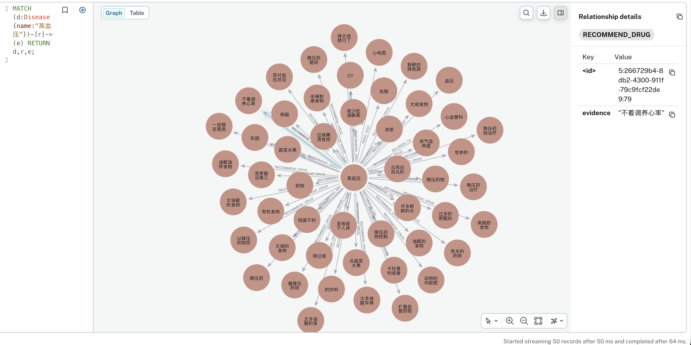
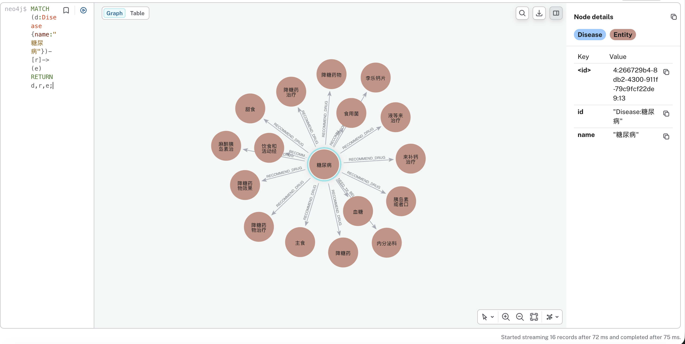
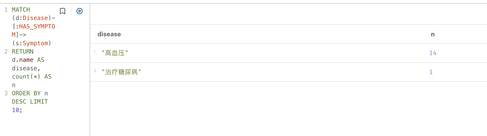

# 大数据原理与技术 作业2：构建小型领域知识图谱（医疗问答）

姓名：梁力航  学号：23336128

## 1. 作业要求

- 自己选择数据集，说明数据来源  
- 使用 NLP 工具（如 spaCy）提取实体和关系  
- 用 Neo4j 构建图谱并可视化关键节点  
- 提交：简单报告（2 页以上）

## 2. 数据集与数据来源

本次作业选用公开中文医疗问答数据集 `Toyhom/Chinese-medical-dialogue-data` 中的样例文件（内科问答片段），其内容为真实医疗问答对，适合抽取 **疾病-症状-检查-用药-科室** 等知识关系。

数据文件：`raw/cmd_sample.csv`（原始 CSV，GBK/GB18030 编码）  
清洗后文件：`data/qa.jsonl`

数据来源链接（写在提交版报告里）：  
- GitHub 仓库：<https://github.com/Toyhom/Chinese-medical-dialogue-data>

## 3. 方法概述

整体流程：

1) 读取原始 CSV（GB18030 编码）并清洗为 JSONL  
2) 使用 spaCy 中文模型 `zh_core_web_sm` 做分词，并结合领域词表/规则抽取实体  
3) 用规则（正则）从回答文本中抽取关系：  
   - `HAS_SYMPTOM`（疾病-症状）  
   - `NEED_TEST`（疾病-检查/检验）  
   - `RECOMMEND_DRUG`（疾病-用药/药物）  
   - `BELONGS_TO`（疾病-科室）
4) 将节点与边写入 Neo4j，并在 Neo4j Browser 中执行查询可视化关键节点

## 4. 实体与关系抽取设计

### 4.1 实体类型

- Disease（疾病）：由标题/问题中出现的疾病词匹配得到（领域小词表 + spaCy 分词）  
- Symptom（症状）：在回答里以“症状/表现/不适”等锚点抓取后续片段，按后缀规则筛选（如“疼/痛/咳嗽/发热”等）  
- Test（检查）：在回答中匹配常见检查关键字（如“血常规/CT/B超/心电图”等）  
- Drug（药物）：在回答中根据“吃/服用/口服/使用”等动词后短语抽取（轻量规则）  
- Department（科室）：直接使用原始数据中的 `department` 字段

### 4.2 关系类型

- `HAS_SYMPTOM`：Disease → Symptom  
- `NEED_TEST`：Disease → Test  
- `RECOMMEND_DRUG`：Disease → Drug  
- `BELONGS_TO`：Disease → Department

## 5. Neo4j 构建与可视化

### 5.1 写库方式

使用官方 `neo4j` Python Driver，将 `outputs/nodes.csv` 与 `outputs/edges.csv` 的内容以 `MERGE` 方式写入图数据库。

### 5.2 示例 Cypher 查询（可视化用）

1) 查看整体图谱：

```cypher
MATCH (d:Disease)-[r]->(e) RETURN d,r,e LIMIT 50;
```

2) 症状关联最多的疾病：

```cypher
MATCH (d:Disease)-[:HAS_SYMPTOM]->(s:Symptom)
RETURN d.name AS disease, count(*) AS n
ORDER BY n DESC LIMIT 10;
```

3) 以“高血压”为中心子图（示例）：

```cypher
MATCH (d:Disease {name:"高血压"})-[r]->(e)
RETURN d,r,e;
```

### 5.3 可视化截图（提交时补充）

本次作业截图与对应查询如下（在 Neo4j Browser：`http://localhost:7474` 执行）。

**截图 1：整体图谱（限定 50 条边）**

查询：

```cypher
MATCH (d:Disease)-[r]->(e) RETURN d,r,e LIMIT 50;
```

截图：


**截图 2：高血压疾病中心子图**

查询：

```cypher
MATCH (d:Disease {name:"高血压"})-[r]->(e) RETURN d,r,e;
```

截图：



**截图 3：糖尿病疾病中心子图（可选补充）**

查询：

```cypher
MATCH (d:Disease {name:"糖尿病"})-[r]->(e) RETURN d,r,e;
```

截图：



**截图 4：症状关联最多的疾病 Top10（可选补充）**

查询：

```cypher
MATCH (d:Disease)-[:HAS_SYMPTOM]->(s:Symptom)
RETURN d.name AS disease, count(*) AS n
ORDER BY n DESC LIMIT 10;
```

截图：



## 6. 实验结果与统计

运行 `src/extract_kg.py` 后会生成 `outputs/stats.json`，包含：
- 使用的问答条数  
- 节点总数、边总数  
- 各关系类型计数  

（在提交版报告中把 `stats.json` 的关键信息摘录到这里，并简要分析：哪些关系最多、原因是什么、规则抽取的局限在哪里等。）

## 7. 结论与不足

- 优点：实现了从公开医疗问答语料到知识图谱的端到端流程，能在 Neo4j 中可视化与查询。  
- 不足：中文通用 NER 对医疗术语覆盖有限；本作业使用的关系抽取为规则方法，召回与精度受规则影响。后续可引入医疗实体词典或使用监督/弱监督关系抽取模型提升质量。

## 8. 复现步骤（交付说明）

见 `README.md`：
- 安装依赖（基于 conda `ml`）  
- 运行 `prepare_dataset.py`、`extract_kg.py`、`load_neo4j.py`  
- 使用 Neo4j Browser 查询与截图
