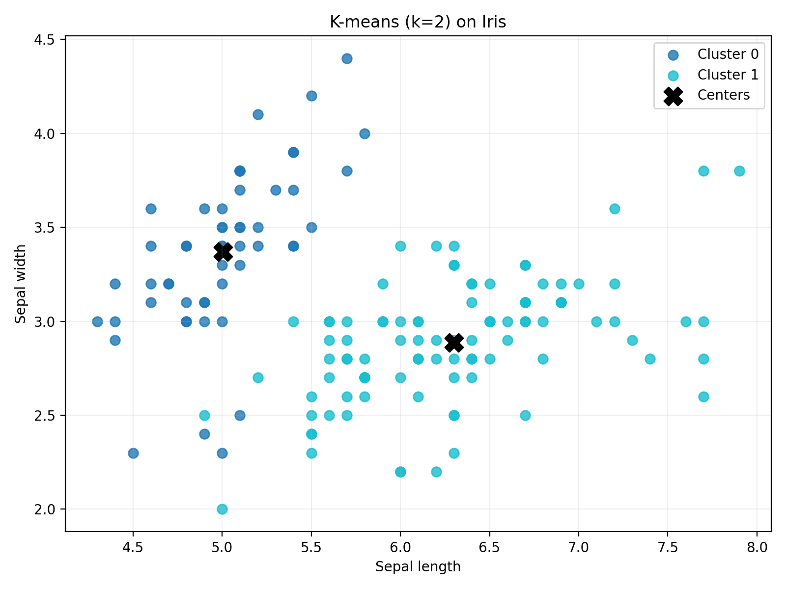
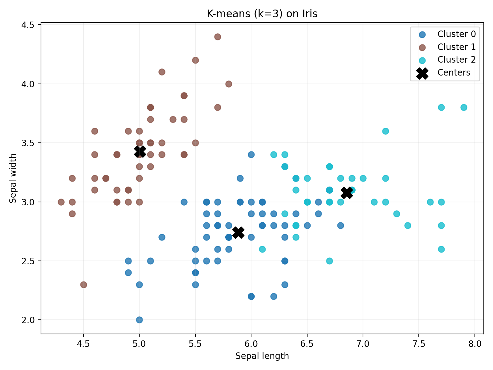
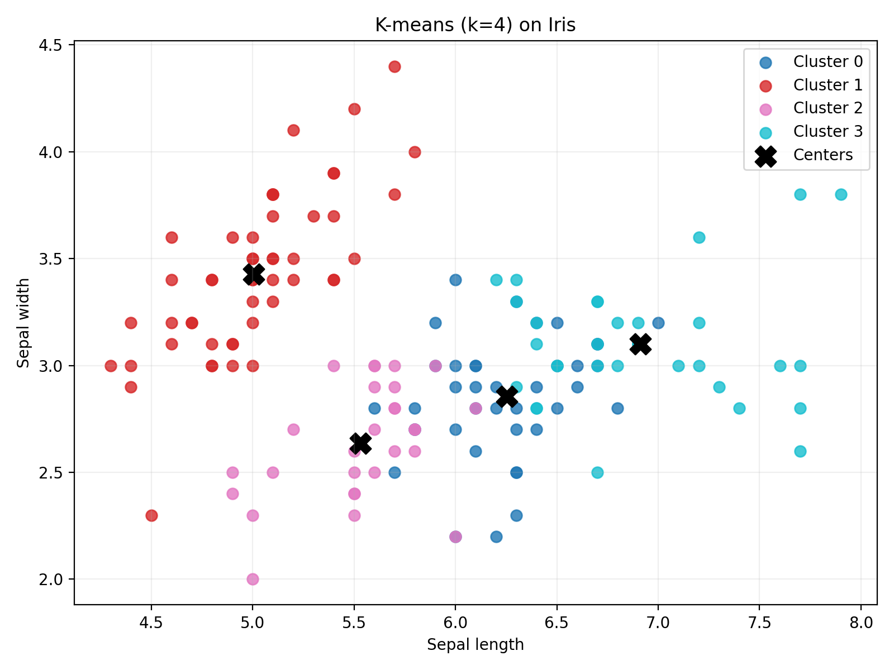
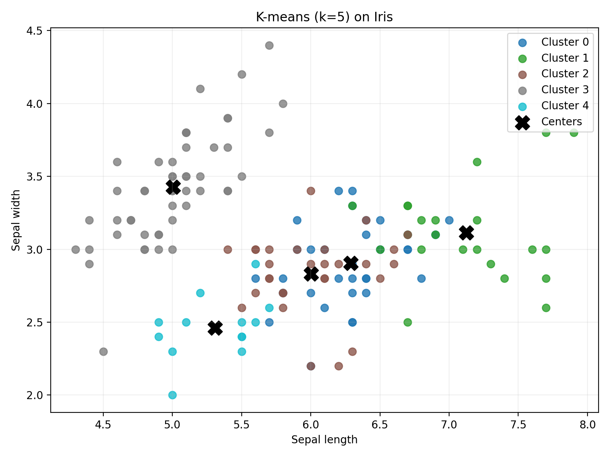
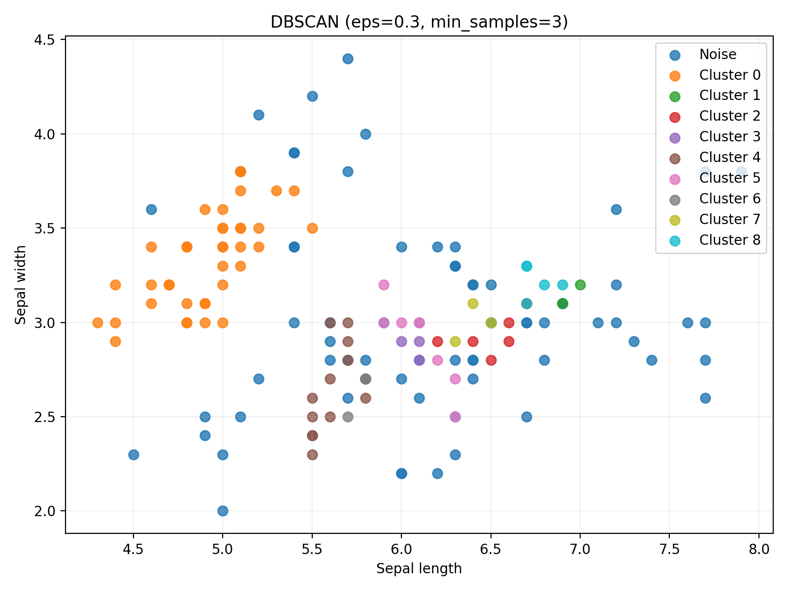
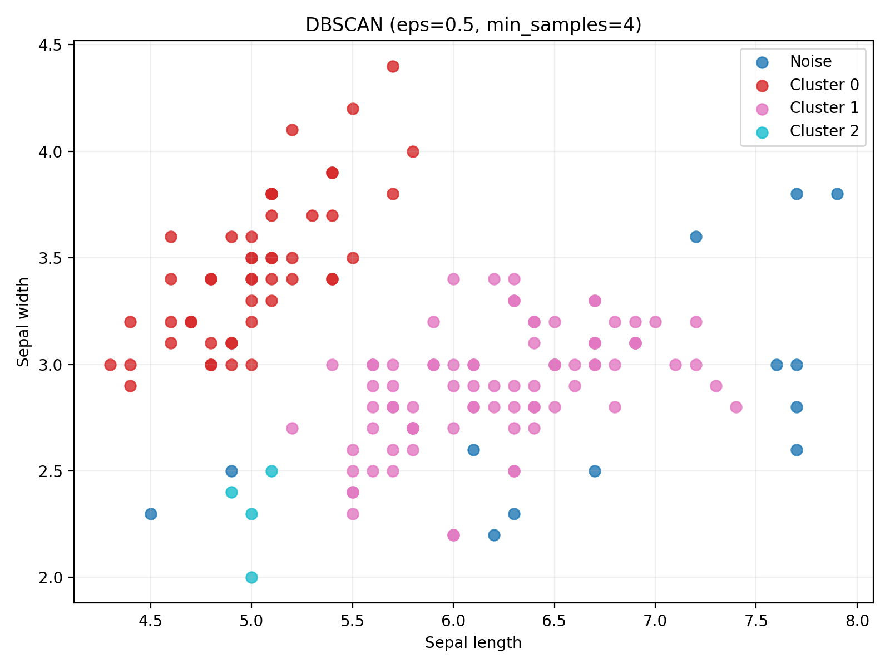
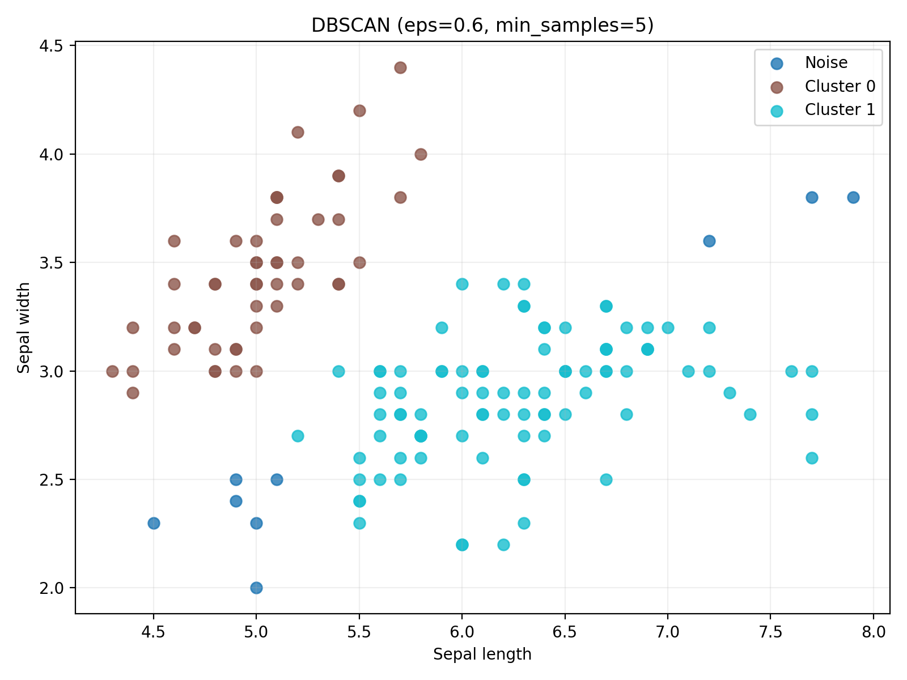

# 大数据原理与技术 作业3实验报告

## 聚类算法对比实验：K-means 与 DBSCAN

姓名：梁力航  
学号：23336128

## 1. 实验目的

本次实验以鸢尾花（Iris）数据集为对象，完成两种经典聚类算法 `K-means` 与 `DBSCAN` 的实现与对比分析。实验目标包括：

1. 理解并实现 K-means 与 DBSCAN 的核心原理，而不是直接调用现成聚类接口；
2. 通过调整关键超参数，观察不同参数对聚类结果的影响；
3. 使用准确率、轮廓系数和 Calinski-Harabasz 指数对聚类结果进行定量评价；
4. 从实验结果出发，分析两种算法各自的适用场景与局限性。

## 2. 实验任务与要求

根据课程作业要求，本次作业需要完成以下内容：

- 在鸢尾花数据集上实现 `K-means` 和 `DBSCAN` 聚类算法；
- 调整参数，如簇数 `k`、邻域半径 `eps` 和最小样本数 `min_samples`，观察聚类结构变化；
- 使用准确率、轮廓系数与 Calinski-Harabasz 指数进行结果评价；
- 禁止直接调用 `scikit-learn` 等工具包中的完整聚类接口，需自行实现算法逻辑；
- 提交代码与不少于 2 页的实验报告。

## 3. 数据集说明

本实验使用经典的 Iris 数据集。该数据集共包含 150 条样本，分别来自 3 类鸢尾花：

- Setosa
- Versicolor
- Virginica

每条样本包含 4 个数值特征：

- 花萼长度（sepal length）
- 花萼宽度（sepal width）
- 花瓣长度（petal length）
- 花瓣宽度（petal width）

本实验在聚类阶段使用全部 4 维特征，以尽可能保留原始数据结构；在可视化阶段，使用前两个特征绘制二维散点图，以直观展示不同参数下的聚类结果。  
需要说明的是，Iris 的真实类别标签仅用于聚类效果评价中的准确率计算，不参与聚类训练过程。

## 4. 实验环境

- 操作系统：macOS
- Python 环境：Anaconda `ml`
- 主要依赖：NumPy、Matplotlib、scikit-learn
- 说明：`scikit-learn` 仅用于加载 Iris 数据集，聚类算法与评价指标均为自行实现

## 5. 算法原理与实现

### 5.1 K-means 算法

K-means 是一种基于划分思想的聚类算法，其基本目标是将样本划分为 `k` 个簇，使得簇内样本尽量相似、簇间样本尽量差异明显。其核心思想是通过“分配 - 更新”的迭代过程不断优化聚类中心。

本实验中，K-means 的实现流程如下：

1. 从数据集中随机选取 `k` 个样本作为初始聚类中心；
2. 计算每个样本到所有中心点的欧氏距离；
3. 将样本分配给最近的聚类中心；
4. 对每个簇内样本求均值，作为新的聚类中心；
5. 若聚类中心变化量小于阈值 `tol`，则停止迭代；否则继续执行上述步骤；
6. 若某一轮出现空簇，则随机选择一个样本重新作为该簇中心。

在本次实验中，为了比较不同簇数设置下的结果差异，分别测试了 `k=2、3、4、5` 四组参数。

### 5.2 DBSCAN 算法

DBSCAN（Density-Based Spatial Clustering of Applications with Noise）是一种基于密度的聚类方法。与 K-means 不同，它不需要预先给定簇数，并且可以自动识别噪声点。

DBSCAN 的核心概念包括：

- `eps`：邻域半径，表示某点周围多大范围内的样本可视为邻居；
- `min_samples`：形成核心点所需的最小邻域样本数；
- 核心点：其 `eps` 邻域内样本数不少于 `min_samples` 的点；
- 噪声点：无法归入任何簇的点。

本实验中，DBSCAN 的实现流程如下：

1. 对每个样本计算其 `eps` 邻域；
2. 判断样本是否为核心点；
3. 从核心点出发，依据密度直达与密度可达关系不断扩展簇；
4. 无法并入任何簇的样本记为噪声点，标签记为 `-1`。

为了比较参数对聚类结果的影响，本实验测试了以下 4 组参数：

- `eps=0.3, min_samples=3`
- `eps=0.5, min_samples=4`
- `eps=0.6, min_samples=5`
- `eps=0.8, min_samples=5`

### 5.3 聚类评价指标

为保证实验的完整性，本次作业中 3 个评价指标也均由本人手工实现。

#### 5.3.1 准确率

聚类标签本身没有固定语义，因此不能直接与真实类别标签逐一比较。实验中采用“簇内多数投票”的方式：对每个聚类簇，找出其中数量最多的真实类别，并将该类别视为该簇的映射类别，最后计算整体分类正确率。

#### 5.3.2 轮廓系数

对于任意一个样本，记：

- `a(i)` 为该样本与同簇其他样本的平均距离；
- `b(i)` 为该样本与最近其他簇样本的平均距离。

则该样本的轮廓系数为：

`s(i) = (b(i) - a(i)) / max(a(i), b(i))`

最终对所有样本的轮廓系数取平均，得到整体轮廓系数。该值越接近 1，通常说明聚类结果越合理。

#### 5.3.3 Calinski-Harabasz 指数

Calinski-Harabasz 指数通过“类间离散度 / 类内离散度”来衡量聚类效果。若不同簇之间分离明显、同一簇内部紧凑，则该指标会更大。因此，该指标越高通常代表聚类结构越清晰。

## 6. 实验结果

### 6.1 指标对比

| 算法 | 参数 | 准确率 | 轮廓系数 | Calinski-Harabasz 指数 | 聚类数 | 噪声点数 |
|---|---|---:|---:|---:|---:|---:|
| K-means | k=2 | 0.6667 | 0.6810 | 513.9245 | 2 | 0 |
| K-means | k=3 | 0.8867 | 0.5512 | 561.5937 | 3 | 0 |
| K-means | k=4 | 0.8800 | 0.4981 | 530.7658 | 4 | 0 |
| K-means | k=5 | 0.9333 | 0.4313 | 446.4427 | 5 | 0 |
| DBSCAN | eps=0.3, min_samples=3 | 0.5467 | 0.6162 | 320.2790 | 9 | 67 |
| DBSCAN | eps=0.5, min_samples=4 | 0.6467 | 0.5082 | 350.8099 | 3 | 13 |
| DBSCAN | eps=0.6, min_samples=5 | 0.6333 | 0.7230 | 620.5962 | 2 | 9 |
| DBSCAN | eps=0.8, min_samples=5 | 0.6667 | 0.6925 | 525.5461 | 2 | 2 |

从表中可以看出，两种算法在不同评价指标上表现并不完全一致，这也说明聚类问题的评价不能只依赖单一指标。

### 6.2 K-means 聚类结果可视化

#### K-means（k=2）



#### K-means（k=3）



#### K-means（k=4）



#### K-means（k=5）



### 6.3 DBSCAN 聚类结果可视化

#### DBSCAN（eps=0.3, min_samples=3）



#### DBSCAN（eps=0.5, min_samples=4）



#### DBSCAN（eps=0.6, min_samples=5）



#### DBSCAN（eps=0.8, min_samples=5）


## 7. 实验分析

### 7.1 K-means 结果分析

当 `k=2` 时，K-means 将数据划分为两个较大簇。由于 Iris 数据本身存在 3 个自然类别，因此虽然该设置下轮廓系数较高，但准确率仅为 `0.6667`，说明聚类结果较为粗糙。

当 `k=3` 时，聚类数与数据集真实类别数一致，准确率提升至 `0.8867`，同时 Calinski-Harabasz 指数也保持在较高水平。综合来看，这一设置较好地匹配了数据本身的结构特征。

当 `k=4` 和 `k=5` 时，准确率继续上升，特别是 `k=5` 达到 `0.9333`。但需要注意，这种提升并不完全意味着聚类质量更高，因为簇数增加后，簇内多数投票更容易获得较高的映射准确率，而轮廓系数却呈下降趋势。这说明聚类被划分得更细，簇间结构反而不如 `k=3` 时自然。

因此，如果从“数据结构合理性”和“指标综合表现”两个角度出发，`k=3` 可以认为是本实验中 K-means 的较优参数。

### 7.2 DBSCAN 结果分析

当 `eps=0.3, min_samples=3` 时，邻域半径过小，算法只能在很局部的范围内形成簇，因此结果被切分成 9 个小簇，同时产生了 67 个噪声点，说明参数设置过于严格。

当 `eps=0.5, min_samples=4` 时，DBSCAN 形成了 3 个簇，结果开始接近真实类别结构，但仍存在 13 个噪声点，说明该参数组合能够较好地区分部分样本，但边界点处理仍较保守。

当 `eps=0.6, min_samples=5` 时，轮廓系数达到 `0.7230`，Calinski-Harabasz 指数达到 `620.5962`，均为本次实验中表现最好的内部指标。这说明该参数组合能够形成较为紧凑且分离良好的簇。不过它仅形成了 2 个簇，与真实类别数并不一致，因此准确率并没有同步提高。

当 `eps=0.8, min_samples=5` 时，噪声点进一步减少，但聚类数仍为 2，且整体指标没有显著优于前一组参数。

综合来看，DBSCAN 对参数较为敏感。特别是 `eps` 的取值会显著影响簇的数量、噪声点比例以及最终聚类形态。

### 7.3 两种算法的对比分析

K-means 和 DBSCAN 在聚类思路上存在明显差异。

K-means 属于基于划分的聚类方法，适合处理簇数较明确、簇形状较规则的数据。在 Iris 这类结构相对清晰的数据集上，其表现比较稳定，尤其在 `k=3` 时能够较好恢复原始类别结构。

DBSCAN 属于基于密度的聚类方法，不需要预先指定簇数，并且能够自动识别噪声点。它在处理噪声较多、簇形状不规则的数据时通常更有优势。但在 Iris 数据集上，由于类别结构较紧凑且相对规则，DBSCAN 对参数的敏感性更加突出，不同参数之间的结果差异较大。

从本实验结果来看：

- 若更关注与真实类别的一致性，K-means 更合适；
- 若更关注簇的紧凑性与分离性，DBSCAN 在某些参数下可以取得较好的内部评价指标；
- 因此，对聚类算法的评价应结合外部指标与内部指标共同分析，而不能简单以某一个数值的高低直接下结论。

## 8. 实验结论

本次实验基于 Iris 数据集，分别实现并比较了 K-means 与 DBSCAN 两种聚类算法，同时手工实现了准确率、轮廓系数和 Calinski-Harabasz 指数三种评价指标。通过实验可以得到以下结论：

1. K-means 在 Iris 数据集上的整体表现较为稳定，其中 `k=3` 是最符合数据原始类别结构的参数设置；
2. DBSCAN 无需预设簇数，且能够识别噪声点，但其聚类效果对参数较为敏感；
3. 不同评价指标反映的是聚类结果的不同侧面，聚类分析应综合准确率、轮廓系数和 Calinski-Harabasz 指数进行判断；
4. 本实验较为直观地展示了两种经典聚类算法在原理、参数特性和适用场景上的差异。

总体而言，对于像 Iris 这样类别较清晰且簇形状相对规则的数据，K-means 更容易获得稳定、可解释的结果；而 DBSCAN 更适合处理含噪声、簇形状复杂的数据集。

## 9. 复现说明

在 `作业3` 目录下依次执行以下命令即可复现实验：

```bash
conda run -n ml python -m pip install -r requirements.txt
conda run -n ml python -m unittest discover -s tests -v
conda run -n ml python src/run_all.py
```

实验运行完成后，所有图像、指标汇总表和结果文件将保存在 `outputs/` 目录中。
